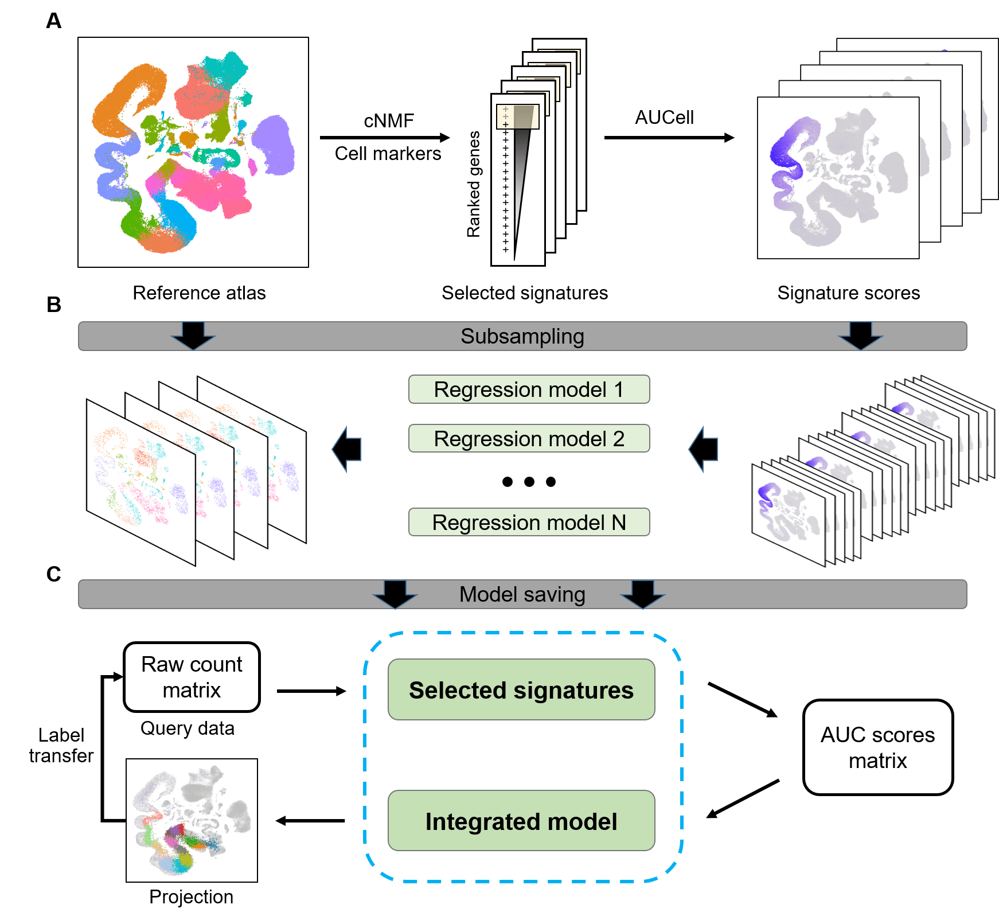

```{r, include = FALSE}
knitr::opts_chunk$set(
  collapse = TRUE,
  comment = "#>",
  fig.path = "man/figures/README-",
  out.width = "100%"
)
```


```{r echo=FALSE, results="hide", message=FALSE}
library("badger")
```

# ProjectSVR 

`r badge_devel("JarningGau/ProjectSVR", "green")`

`ProjectSVR` is a machine learning-based algorithm for mapping the query cells onto well-constructed reference atlas.




## Installation

Install the development version from GitHub use:

```{r eval=FALSE}
install.packages("devtools")
devtools::install_github("JarningGau/ProjectSVR")
```

## Usage/Demos

### Tutorials

- Mapping PBMC dataset onto pre-build PBMC reference (from DISCO database).

- Mapping tumor-infiltrated T cell to pan-cancer T cell landscape.

### Downloading pre-built references:

- You can download pre-built references from [Zenodo]().

## Installation notes

`ProjectSVR` has been successfully installed on Linux using the devtools package to install from GitHub.

Dependencies:

- R >= 4.1
- reticulate
- AUCell

## Reproducing results from manuscript

Code to reproduce results from the Gao et al. manuscript is available on github.com/jarninggau/ProjectSVR_reproducibility.

## Code of Conduct
  
  Please note that the ProjectSVR project is released with a [Contributor Code of Conduct](https://contributor-covenant.org/version/2/1/CODE_OF_CONDUCT.html). By contributing to this project, you agree to abide by its terms.
