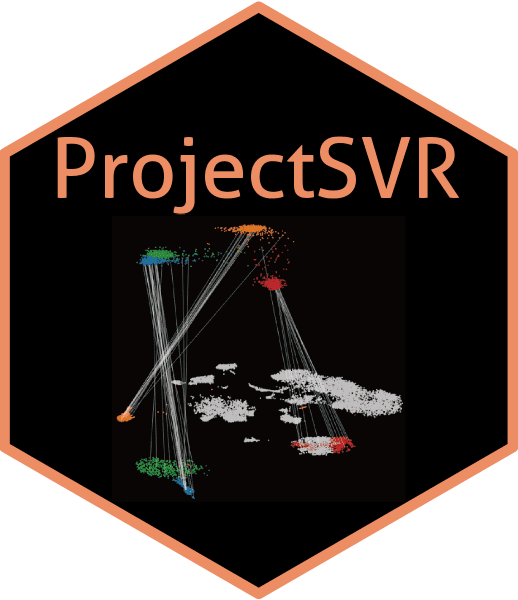
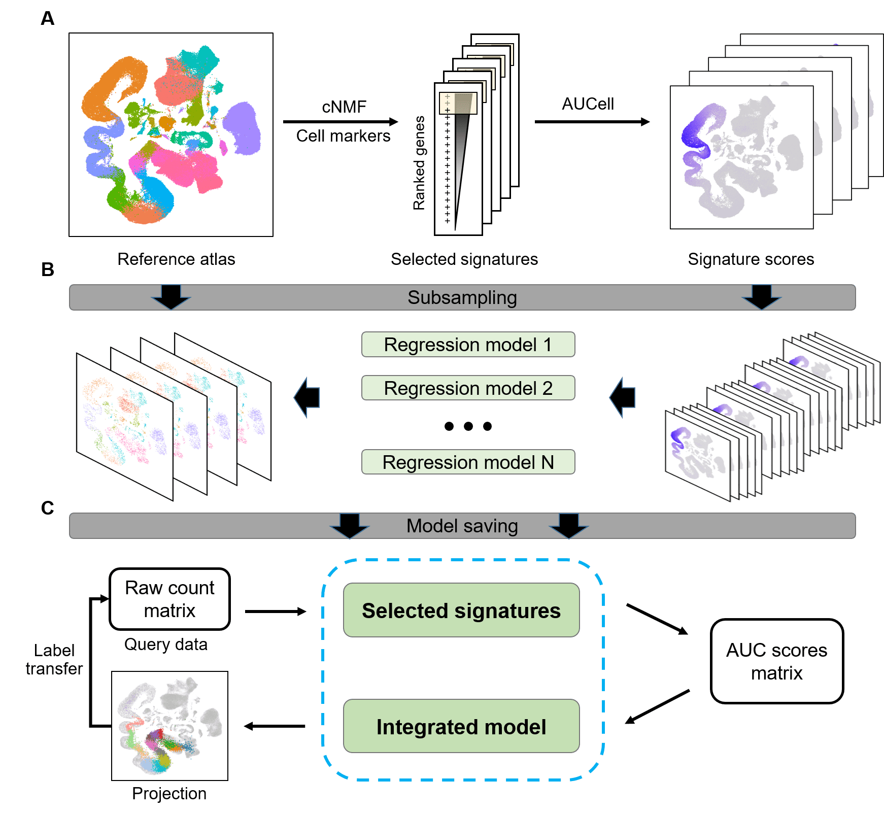

# ProjectSVR 

[](https://github.com/JarningGau/ProjectSVR)

`ProjectSVR` is a machine learning-based algorithm for mapping the query
cells onto well-constructed reference atlas.



## Related resources

### Reference atlas

The reference cell atlases involved in ProjectSVR paper are available at
<https://zenodo.org/record/8350746>.

### Query dataset

The query datasets involved in ProjectSVR paper are available at
<https://zenodo.org/record/8350748>.

### Pre-built reference model

You can download pre-build reference models from
[Zenodo](https://zenodo.org/record/8350732).

| Name                                                            | Source                                         | Version | Download                                                                         |
|-----------------------------------------------------------------|------------------------------------------------|---------|----------------------------------------------------------------------------------|
| PBMC (DISCO)                                                    | <https://www.immunesinglecell.org/atlas/blood> | 0.2     | [download](https://zenodo.org/record/8350732/files/model.disco_pbmc.rds)         |
| Mouse testicular cell atlas (mTCA)                              | This paper                                     | 0.2     | [download](https://zenodo.org/record/8350732/files/model.mTCA.rds)               |
| Maternal-fetal interface atlas (Vento 2018)                     | <https://doi.org/10.1038/s41586-018-0698-6>    | 0.2     | [download](https://zenodo.org/record/8350732/files/model.Vento2018.MFI.rds)      |
| Pan cancer tumor infiltrated CD4+ T cell landscape (Zheng 2021) | <https://doi.org/10.1126/science.abe6474>      | 0.2     | [download](https://zenodo.org/record/8350732/files/model.Zheng2021.CD4Tcell.rds) |
| Pan cancer tumor infiltrated CD8+ T cell landscape (Zheng 2021) | <https://doi.org/10.1126/science.abe6474>      | 0.2     | [download](https://zenodo.org/record/8350732/files/model.Zheng2021.CD8Tcell.rds) |

## Tutorials

The ProjectSVR webpage with all the documentation and tutorials is
[here](https://jarninggau.github.io/ProjectSVR/).

We have various examples, including:

A generic quick start tutorial on a demo PBMC scRNA-seq dataset.

- [Quick start: mapping PBMC dataset onto pre-build PBMC
  reference.](https://jarninggau.github.io/ProjectSVR/articles/quick_start.html)

Tutorials on how to build projection models for reference atlas.

- [DISCO blood
  atlas](https://jarninggau.github.io/ProjectSVR/articles/model_pbmc.html)

- [Maternal-fetal interface
  atlas](https://jarninggau.github.io/ProjectSVR/articles/model_mfia.html)

- [Pan-cancer T cell
  lanscape](https://jarninggau.github.io/ProjectSVR/articles/model_pctl.html)

- [Mouse testicular cell
  atlas](https://jarninggau.github.io/ProjectSVR/articles/model_mtca.html)

Tutorials on how to project the query datasets onto reference atlas via
pre-build models.

- [Decidual immune microenvironment of RPL
  patients](https://jarninggau.github.io/ProjectSVR/articles/mapQuery_immune_RPL.html)

- [ICB responsiveness of
  BRCA](https://jarninggau.github.io/ProjectSVR/articles/mapQuery_ICB_BRCA.html)

- [Genetic perturbed germ cells
  (Zfp541-KO)](https://jarninggau.github.io/ProjectSVR/articles/mapQuery_Zfp541-KO.html)

- [Genetic perturbed germ cells
  (Ythdc2-KO)](https://jarninggau.github.io/ProjectSVR/articles/mapQuery_Ythdc2-KO.html)

- [In vitro induced
  meiosis](https://jarninggau.github.io/ProjectSVR/articles/mapQuery_invitro_meiosis.html)

A tutorial on how to train a model to predict pseudotime.

- [Training the reference pseudotime
  model](https://jarninggau.github.io/ProjectSVR/articles/misc_Ythdc2-KO_pseudotime.html)

A tutorial on how to train a multi-classifier for cell type auto
annotation.

- [Training an ensemble SVM model for cell type
  prediction](https://jarninggau.github.io/ProjectSVR/articles/misc_disco_pbmc_svm.html)

## Installation

Install the development version from GitHub use:

``` r
install.packages("devtools")
devtools::install_github("JarningGau/ProjectSVR")
```

`ProjectSVR` has been successfully installed and test on ubuntu, centOS
and wsl2.

### Dependencies

- R \>= 4.1

### External packages

Install `AUCell` or `UCell` for signature score calculation.

``` r
## install UCell
# R = 4.3
BiocManager::install("UCell") # or
# R < 4.3
remotes::install_github("carmonalab/UCell", ref="v1.3")
## install AUCell
BiocManager::install("AUCell")
```

We provided a wrapper
[`RunCNMF`](https://jarninggau.github.io/ProjectSVR/reference/RunCNMF.html)
of python pacakge [`cnmf`](https://github.com/dylkot/cNMF) for feature
selection. If you want to use it, you should install `cnmf` through
`reticulate`.

``` r
install.packages("reticulate")
reticulate::install_miniconda()
## install sceasy for single cell data format transformation.
devtools::install_github("cellgeni/sceasy")
reticulate::py_install("anndata")
## install cnmf package via reticulate
reticulate::py_install("cnmf")
```

## Code of Conduct

Please note that the ProjectSVR project is released with a [Contributor
Code of
Conduct](https://contributor-covenant.org/version/2/1/CODE_OF_CONDUCT.html).
By contributing to this project, you agree to abide by its terms.
