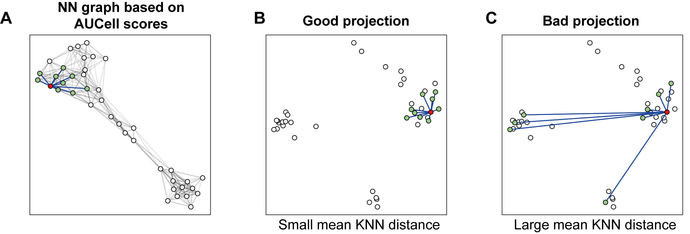

```{r setup, include=FALSE}
all_times <- list()  # store the time for each chunk
knitr::knit_hooks$set(time_it = local({
  now <- NULL
  function(before, options) {
    if (before) {
      now <<- Sys.time()
    } else {
      res <- difftime(Sys.time(), now, units = "secs")
      all_times[[options$label]] <<- res
    }
  }
}))
knitr::opts_chunk$set(
  tidy = TRUE,
  tidy.opts = list(width.cutoff = 95),
  fig.width = 10,
  message = FALSE,
  warning = FALSE,
  time_it = TRUE
)
```

## Download related dataset

```{r, results='hide'}
library(ProjectSVR)
library(Seurat)
library(tidyverse)
options(timeout = max(3600, getOption("timeout")))
`%notin%` <- Negate(`%in%`)
```

```{r, eval=FALSE}
# reference datass
download.file(url = "https://zenodo.org/record/8147304/files/disco_pbmc_small.seurat.slim.rds", destfile = "disco_pbmc_small.seurat.slim.rds")
# query data
download.file(url = "https://zenodo.org/record/8147304/files/query_pbmc_small.seurat.slim.rds", destfile = "query_pbmc_small.seurat.slim.rds")
```


## Build Reference Model

```{r, fig.width=9, fig.height=5}
seu.ref <- readRDS("disco_pbmc_small.seurat.slim.rds")

DimPlot(seu.ref, pt.size = .4) +
  scale_color_manual(values = seu.ref@misc$data.refplot$colors) +
  geom_text(inherit.aes = F, data = seu.ref@misc$data.refplot$text.pos,
            mapping = aes(x, y, label = label), size = 4)
```

### Extract signatures

Here we extract the top25 marker genes for each cell type (ribosomal and mitochondrial genes were removed).

```{r}
data(ribo.genes)

table(Idents(seu.ref))
seu.ref[["RNA"]]@counts <- seu.ref[["RNA"]]@data
seu.ref <- NormalizeData(seu.ref)
all.markers <- mcFindAllMarkers(seu.ref, do.flatten = F, n.cores = 20)

top.genes <- lapply(all.markers, function(xx){
  yy <- subset(xx, p_val_adj < 1e-6 & avg_log2FC > log2(1.5))
  yy <- subset(yy, Gene.name.uniq %notin% ribo.genes)
  yy <- yy[!grepl("^MT-", yy$Gene.name.uniq), ]
  head(yy$Gene.name.uniq, 25)
})

sapply(top.genes, length)
# rename the gene set
# [Note] Avoid to use '_' or '-' in the gene set names.
names(top.genes) <- paste0("feature.", 1:length(top.genes))
# the background genes are the union of all markers
bg.genes <- do.call(c, top.genes) %>% unique()
```

### Transfer raw count matrix to gene set score matrix

```{r, fig.width=5, fig.height=4}
seu.ref <- ComputeModuleScore(seu.ref, gene.sets = top.genes, 
                              bg.genes = bg.genes, method = "UCell", 
                              cores = 20)
# The signature score matrix is stored in 'SignatureScore' assay
Assays(seu.ref)
DefaultAssay(seu.ref) <- "SignatureScore"
FeaturePlot(seu.ref, features = "feature.1", pt.size = .3)
```

### Training reference model

```{r}
gss.mat <- FetchData(seu.ref, vars = rownames(seu.ref))
embeddings.df <- FetchData(seu.ref, vars = paste0("UMAP_", 1:2))
batch.size = 4000 # number of subsampled cells for each SVR model 
n.models = 5      # number of SVR models trained
umap.model <- FitEnsembleSVM(feature.mat = gss.mat,
                             emb.mat = embeddings.df,
                             batch.size = batch.size,
                             n.models = n.models,
                             cores = 5)
```

### Save the reference model

ref.cellmeta stores:

1. [optional] colors: for plots

2. [optional] text.pos: text annotation on the reference plots

3. meta.data: cell meta data (embeddings + cell type information)

```{r}
ref.cellmeta <- seu.ref@misc$data.refplot
ref.cellmeta$meta.data <- FetchData(seu.ref, vars = c(paste0("UMAP_", 1:2), "cell_type", "cell_subtype"))

reference <- list(
  "models" = list(
    "umap" = umap.model
  ),
  "genes" = list(
    "gene.sets" = top.genes, # list
    "bg.genes" = bg.genes # vector
  ),
  "ref.cellmeta" = ref.cellmeta # list for reference plot
)

saveRDS(reference, "model.disco_pbmc_quickstart.rds")
```

## Map Query to Reference

### Reference mapping

```{r, fig.width=12, fig.height=5}
reference <- readRDS("model.disco_pbmc_quickstart.rds")
seu.q <- readRDS("query_pbmc_small.seurat.slim.rds")
seu.q[["RNA"]]@counts <- seu.q[["RNA"]]@data
seu.q <- ProjectSVR::MapQuery(seu.q, reference = reference, 
                              add.map.qual = T, ncores = 5)

p1 <- DimPlot(seu.q, reduction = "ref.umap", group.by = "donor")
p2 <- DimPlot(seu.q, reduction = "ref.umap", group.by = "cell_subtype", 
              label = T)
(p1 + p2) & ggsci::scale_color_d3("category20")
```

### Maping quality

The metric for evaluating the mapping quality is essential for users to identify and discard erroneous projected cells. We introduce the mean kNN distance and demonstrate its utilization for quality control in reference mapping using ProjectSVR.

We believe that a good projection means the local topological relationship should be kept after projection. Thus we build a nearest neighbor (NN) graph in feature space (signature score matrix) and measure the average distance of its K nearest neighbors (called `mean.knn.dist`). A smaller `mean.knn.dist` means a good projection.



To access the p-value of a given `mean.knn.dist`, we build the null distribution by calculating the randomly selected K nearest neighbors for the given cell and repeat the process by 1000 times. Then the empirical p values were calculated according to this null distribution. Adjusted p values were calculated by Benjamini-Hochberg Procedure.

```{r, fig.width=5, fig.height=3}
data.plot <- FetchData(seu.q, vars = c(paste0("refUMAP_", 1:2), "mean.knn.dist", "mapQ.p.adj"))

ggplot(data.plot, aes(mean.knn.dist, -log10(mapQ.p.adj))) +
  geom_point(size = .3) + 
  geom_vline(xintercept = 4, linetype = "dashed", color = "blue")
```

```{r, fig.width=14, fig.height=4}
data.plot <- FetchData(seu.q, vars = c(paste0("refUMAP_", 1:2), "mean.knn.dist", "mapQ.p.adj"))

cut.off <- 4
low.qual.prop <- prop.table(table(data.plot$mean.knn.dist > cut.off))["TRUE"]
low.qual.prop <- round(low.qual.prop, 4) *100

p1 <- ggplot(data.plot, aes(refUMAP_1, refUMAP_2)) + 
  geom_point(aes(color = mean.knn.dist), size = .2) + 
  scale_color_gradientn(colours = c("blue", "red"), values = c(0.1, 0.2, 1)) + 
  ggtitle("Mapping quality") + 
  theme_classic(base_size = 15) + 
  theme(axis.text = element_text(color = "black"),
        plot.title = element_text(hjust = .5, face = "bold"))

p2 <- ggplot(data.plot, aes(mean.knn.dist)) + 
  geom_density(fill = "lightblue") + 
  geom_vline(xintercept = cut.off, linetype = "dashed", color = "blue") + 
  ggtitle("Distribution of mean \nkNN dist") + 
  theme_classic(base_size = 15) + 
  theme(axis.text = element_text(color = "black"),
        plot.title = element_text(hjust = .5, face = "bold"))

p3 <- ggplot(data.plot, aes(refUMAP_1, refUMAP_2)) + 
  geom_point(aes(color = mean.knn.dist > cut.off, size = mean.knn.dist > cut.off)) + 
  ggtitle(sprintf("Low-quality projection (%s%%)", low.qual.prop)) + 
  scale_color_manual(values = c("grey", "red")) + 
  scale_size_manual(values = c(0.1, 0.5), guide = "none") + 
  guides(color = guide_legend(title = sprintf("mean.knn.dist\n(>%s)", cut.off))) + 
  theme_classic(base_size = 15) + 
  theme(axis.text = element_text(color = "black"),
        plot.title = element_text(hjust = .5, face = "bold"))

p1 + p2 + p3
```

```{r, fig.width=18, fig.height=14}
seu.q$cell_subtype2 <- seu.q$cell_subtype

PlotProjection(seu.q, reference, split.by = "cell_subtype2", 
               ref.color.by = "cell_subtype",
               ref.size = .5, ref.alpha = .3, query.size = 1, 
               query.alpha = .5, n.row = 4)
```

### Label transfer

```{r, fig.width=9, fig.height=5}
seu.q <- ProjectSVR::LabelTransfer(seu.q, reference, ref.label.col = "cell_subtype")

DimPlot(seu.q, reduction = "ref.umap", group.by = "knn.pred.celltype") + 
  scale_color_manual(values = reference$ref.cellmeta$colors)
```

```{r, fig.width=8, fig.height=7}
data.stat <- table(seu.q$cell_subtype, seu.q$knn.pred.celltype)
pheatmap::pheatmap(data.stat, display_numbers = T, number_format = "%.0f", 
                   number_color = "black")
```

<details>
  <summary>**Session Info**</summary>
```{r}
sessionInfo()
```
</details>


